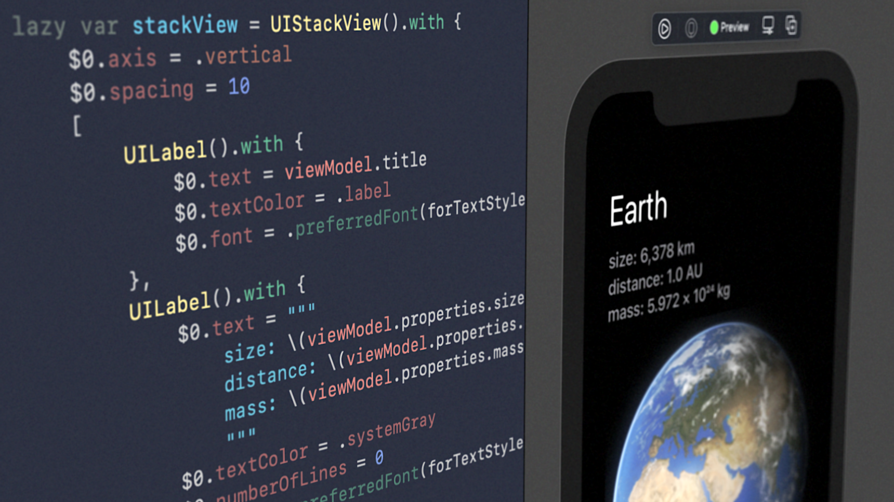

# Withable

Declarative UIKit in 10 lines of code.

<p align="center"></p>

See corresponding article at [**Declarative UIKit with 10 lines of code** A simple extension instead of libraries] for more.


## How to use

With a **single extension** on `AnyObject` you can do things like this.

```Swift
class ContentViewController: UIViewController {
    
    ...
    
    lazy var titleLabel = UILabel()
        .with {
            $0.text = viewModel.title
            $0.textColor = .label
            $0.font = .preferredFont(forTextStyle: .largeTitle)
        }
    
    ...
}
```

With **any kind of object**, really.

```Swift
lazy var submitButton = UIButton()
    .with {
        $0.setTitle("Submit", for: .normal)
        $0.addTarget(self, action: #selector(didTapSubmitButton), for: .touchUpInside)
    }
```

```Swift
present(
    DetailViewController()
        .with {
            $0.modalTransitionStyle = .crossDissolve
            $0.modalPresentationStyle = .overCurrentContext
        },
    animated: true
)
```

```Swift
present(
    UIAlertController(title: title, message: message, preferredStyle: .alert)
        .with {
            $0.addAction(UIAlertAction(title: "Ok", style: .default, handler: nil))
        },
    animated: true
)
```

```Swift
let today = DateFormatter()
    .with {
        $0.dateStyle = .medium
        $0.locale = Locale(identifier: "en_US")
    }
    .string(from: Date())
```

```Swift
lazy var displayLink = CADisplayLink(target: self, selector: #selector(update))
    .with {
        $0.isPaused = true
        $0.preferredFramesPerSecond = 120
        $0.add(to: RunLoop.main, forMode: .common)
    }
```

Even value types as well (after conforming to `Withable`). 

```Swift
extension PersonNameComponents: Withable { }

let name = PersonNameComponents()
    .with {
        $0.givenName = "Geri"
        $0.familyName = "Borbás"
    }
```


## How it works

It is implemented in this `with` method. 💎

```Swift
public extension Withable {
    
    func with(_ closure: (Self) -> Void) -> Self {
        closure(self)
        return self
    }
}
```

The method implements pretty **classic patterns**. You can think of it as something between an unspecialized/parametric builder, or a **decorator** with customizable/pluggable decorating behaviour. See [`Withable.swift`] for all details (generics, value types). 


## UIKit benefits

The package contains a couple of **convinient extensions** of `UIKit` classes what I use (probably will be moved to their own package as they grow). I left them here intentionally as they may exemplify how you can **create your own extensions** tailored for your codebases' needs.

For example, you may create a convenient **`text` decorator** for `UILabel`.

```Swift
extension UILabel {
    
    func with(text: String?) -> Self {
        with {
            $0.text = text
        }
    }
}
```

Furthermore, you can condense your **styles to simple extensions** like this.

```Swift
extension UILabel {
    
    var withTitleStyle: Self {
        with {
            $0.textColor = .label
            $0.font = .preferredFont(forTextStyle: .largeTitle)
        }
    }
    
    var withPropertyStyle: Self {
        with {
            $0.textColor = .systemBackground
            $0.font = .preferredFont(forTextStyle: .headline)
            $0.setContentCompressionResistancePriority(.required, for: .vertical)
        }
    }
    
    var withPropertyValueStyle: Self {
        with {
            $0.textColor = .systemGray
            $0.font = .preferredFont(forTextStyle: .body)
        }
    }
    
    var withParagraphStyle: Self {
        with {
            $0.textColor = .label
            $0.numberOfLines = 0
            $0.font = .preferredFont(forTextStyle: .footnote)
        }
    }
}
```

With extensions like that, you can clean up view controllers.

```Swift
class ContentViewController: UIViewController {
    
    let viewModel = Planets().earth
    
    private lazy var body = UIStackView().vertical(spacing: 10).views(
        UILabel()
            .with(text: viewModel.title)
            .withTitleStyle,
        UIStackView().vertical(spacing: 5).views(
            UIStackView().horizontal(spacing: 5).views(
                UILabel()
                    .with(text: "size")
                    .withPropertyStyle
                    .withBox,
                UILabel()
                    .with(text: viewModel.properties.size)
                    .withPropertyValueStyle,
                UIView.spacer
            ),
            UIStackView().horizontal(spacing: 5).views(
                UILabel()
                    .with(text: "distance")
                    .withPropertyStyle
                    .withBox,
                UILabel()
                    .with(text: viewModel.properties.distance)
                    .withPropertyValueStyle,
                UIView.spacer
            ),
            UIStackView().horizontal(spacing: 5).views(
                UILabel()
                    .with(text: "mass")
                    .withPropertyStyle
                    .withBox,
                UILabel()
                    .with(text: viewModel.properties.mass)
                    .withPropertyValueStyle,
                UIView.spacer
            )
        ),
        UIImageView()
            .with(image: UIImage(named: viewModel.imageAssetName)),
        UILabel()
            .with(text: viewModel.paragraphs.first)
            .withParagraphStyle,
        UILabel()
            .with(text: viewModel.paragraphs.last)
            .withParagraphStyle,
        UIView.spacer
    )
    
    override func viewDidLoad() {
        super.viewDidLoad()
        view.addSubview(body)
        view.backgroundColor = .systemBackground
        body.pin(
            to: view.safeAreaLayoutGuide,
            insets: UIEdgeInsets(top: 30, left: 30, bottom: 30, right: 30)
        )
    }
}
```

I recommend to read the corresponding article at [**Declarative UIKit with 10 lines of code** A simple extension instead of libraries] to read more about the background and more examples.


## Used by Apple

Later on, I found out that on occasions **Apple uses the very same pattern** to enable decorating objects inline. These decorator functiona are even uses the same `with` naming convention.

These examples below are in vanilla iOS. 🍦

```Swift
let arrow = UIImage(named: "Arrow").withTintColor(.blue)
let mail = UIImage(systemName: "envelope").withRenderingMode(.alwaysTemplate)
let color = UIColor.label.withAlphaComponent(0.5)
```
    
* [`UIImage.withTintColor(_:)`]
* [`UIImage.withAlphaComponent(_:)`]
* [`UIImage.Configuration.withTraitCollection(_:)`]
* More examples in [`UIImage.Configuration`]


## Stored properties in extensions

In addition, the package contains an `NSObject` extension that helps creating **stored properties in extensions**. I ended up including it because I found extending `UIKit` classes with stored properties is a pretty common usecase. See [`NSObject+Extensions.swift`] and [`UIButton+Extensions.swift`] for more.

You can do things like this.

```Swift
extension UITextField {
    
    var nextTextField: UITextField? {
        get {
            associatedObject(for: "nextTextField") as? UITextField
        }
        set {
            set(associatedObject: newValue, for: "nextTextField")
        }
    }
}
```


## Declare constraints inline

One more secret weapon is the [`UIView.onMoveToSuperview`] extension, which is simply a closure called (once) when the `view` gets added to a `superview`. With that, you can declare the constraints in advance using this closure at initialization time, then they are added/activated later on at runtime by the time when the view has a superview. See [Keyboard Avoidance] repository for usage examples.


## License

> Licensed under the [**MIT License**](https://en.wikipedia.org/wiki/MIT_License).


[`Withable.swift`]: Withable/Withable.swift
[**Declarative UIKit with 10 lines of code** A simple extension instead of libraries]: https://blog.eppz.eu/declarative-uikit-with-10-lines-of-code/
[`NSObject+Extensions.swift`]: Withable/NSObject+Extensions.swift
[`UIButton+Extensions.swift`]: Withable/UI/UIButton+Extensions.swift
[`UIImage.withTintColor(_:)`]: https://developer.apple.com/documentation/uikit/uiimage/3327300-withtintcolor
[`UIImage.withAlphaComponent(_:)`]: https://developer.apple.com/documentation/uikit/uicolor/1621922-withalphacomponent
[`UIImage.Configuration.withTraitCollection(_:)`]: https://developer.apple.com/documentation/uikit/uiimage/configuration/3295946-withtraitcollection
[`UIImage.Configuration`]: https://developer.apple.com/documentation/uikit/uiimage/configuration
[`UIView.onMoveToSuperview`]: Withable/UIView+Extensions.swift
[Keyboard Avoidance]: https://github.com/Geri-Borbas/iOS.Blog.Keyboard_Avoidance
